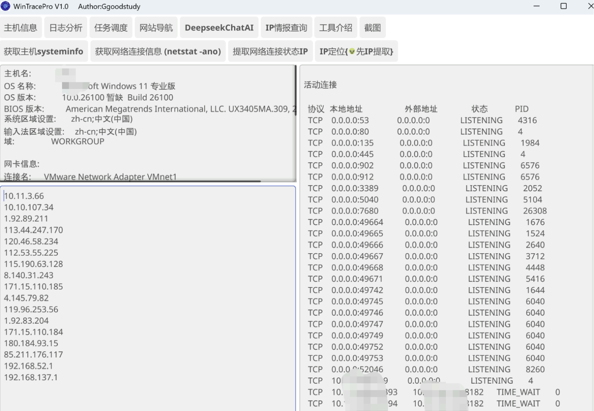
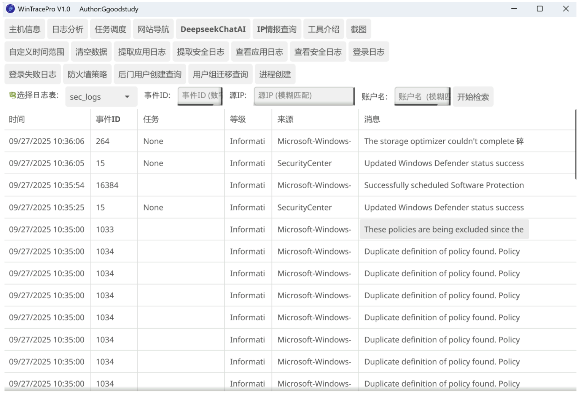
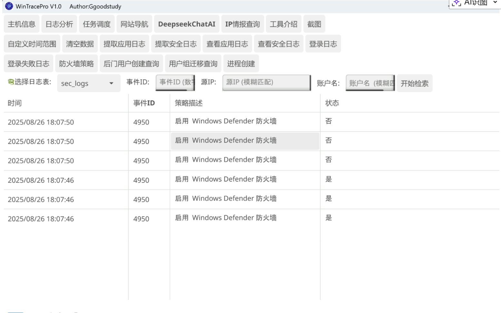
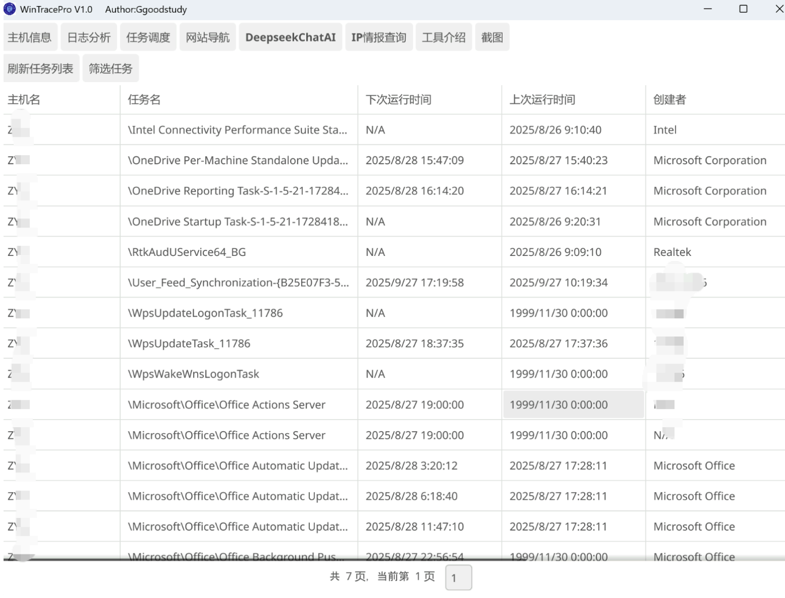
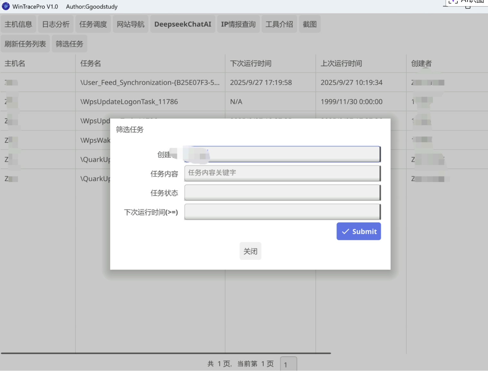
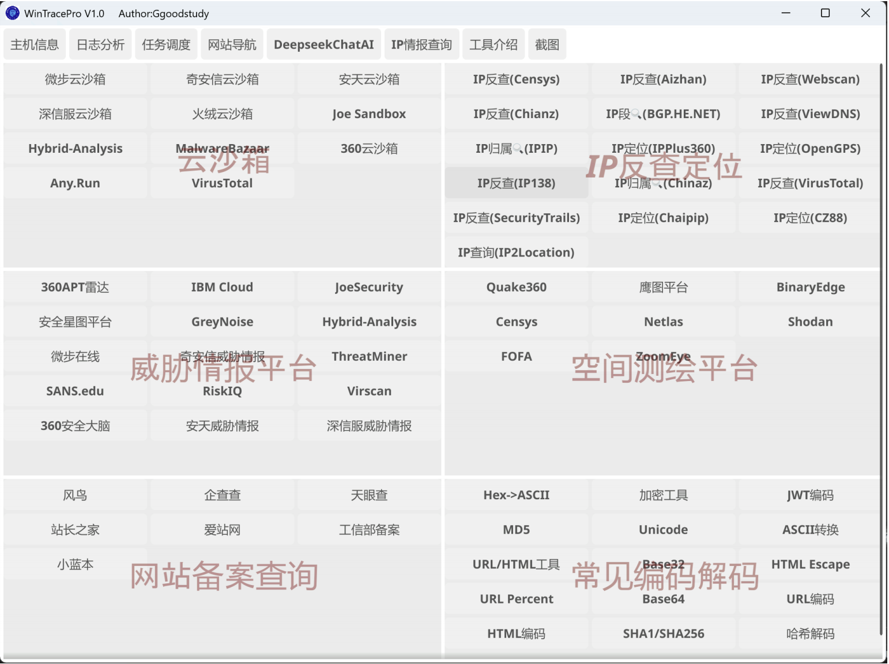
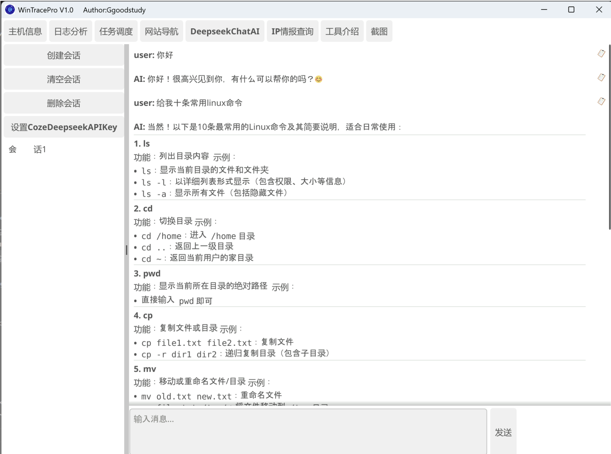
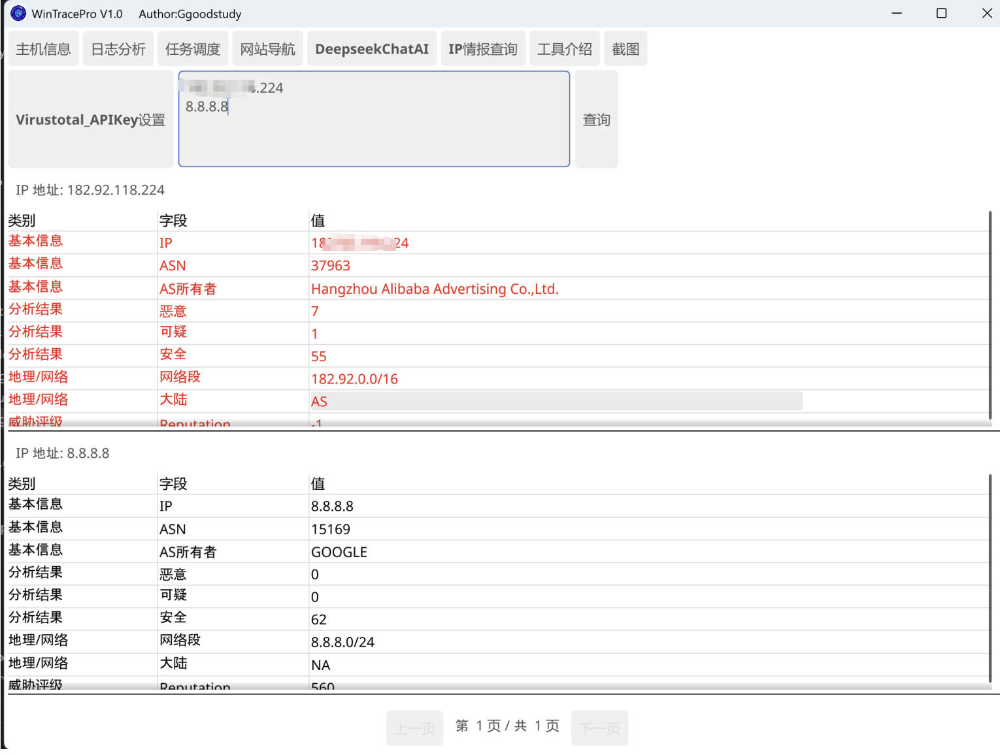
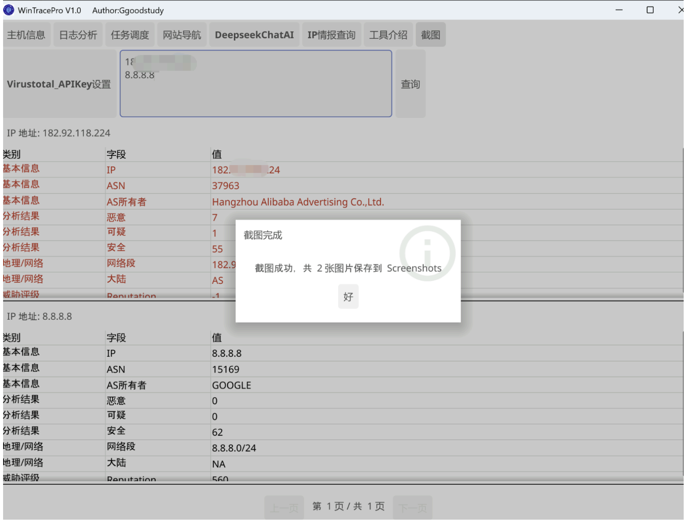

## WinTracePro1.0版本

这款工具是为蓝队溯源上机分析准备的，目标是小白就能使用的，目前支持的事件类型还是可以的，后期计划更新上内存马校验功能，目前事件分析可以配合AI去一件分析。

**需要xdm的Stra支持一哈哈**

## 授权码

授权码

> hFhDFYKh6rNTAqjcBJu/Cg==

## ▶主机信息模块

- 获取主机信息和网卡信息
- 获取网络连接状态
- 网络外联IP定位

## ▶日志分析模块
- 提取 Windows 应用日志（Application Log）
- 提取 Windows 安全日志（Security Log）
- 支持查看登录成功（4624）、登录失败（4625）、防火墙日志等
- 日志保存到 log.db（SQLite 数据库）
- UI 分页展示、点击查看完整内容
- 支持模糊查询快速定位IP和用户

## ▶系统支持
- Windows 10/11 ✅
- Windows Server 2012/2016/2019/2022 ✅
- Windows Server 2008 R2 ✅
- Windows Server 2008 非 R2 ⚠️ 仅支持 Get-EventLog，需升级 PowerShell

## ▶任务调度
- 提取定时任务详情，实时刷新
- 支持任务筛选模糊查询

## ▶网站导航模块
- 云沙箱、IP反查、威胁情报、空间测绘、网站备案、常见编码解码

## ▶DeepseekChatAI模块
- 支持 Deepseek API 调用
- 上下文聊天、会话创建、清空、删除

## ▶IP情报查询模块
- 调用 VirtualTools API 查询IP
- 请求率: 每分钟4次，每日500次，每月15.5K次
- 红色标记已打标签IP

## ▶截图模块
- 点击“截图”按钮即可截取全屏
- 自动保存到当前目录下的 Screenshots 文件夹
- 支持多显示器同时截图
- 弹窗提示保存的截图数量和保存路径

## ▶使用方法
1. 启动工具后选择日志类型
2. 点击按钮执行提取，日志保存到本地数据库
3. 分页浏览日志，点击查看详情
4. 可通过筛选或时间选择缩小范围

## ▶注意事项
- 必须以管理员权限运行
- 默认拉取最近7天日志，可自定义
- 首次运行会自动创建 log.db，config.json

## WinTracePro2.0版本

#### 更新内容

- 修复在无管理员权限下执行Powershell报错的bug共计10处
- 新增用户属性查询修改，可以直接定位用户属性的事件id和详情，修改的详细参数
- 新增一键快速分析功能，可以直接根据数据库生成事件摘要
- 新增根据数据库内容利用AI依据各个表的时间线进行安全分析(建议使用AI分析+人工确认)